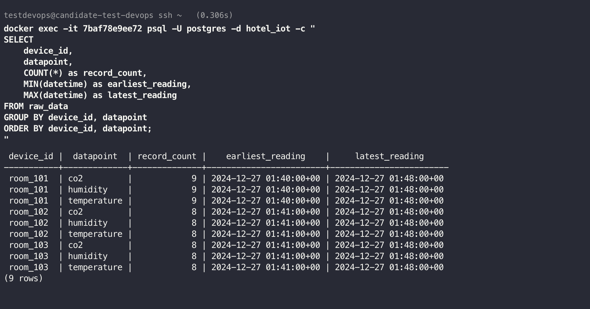
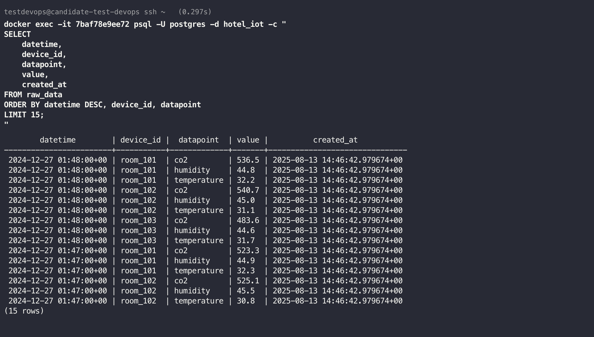
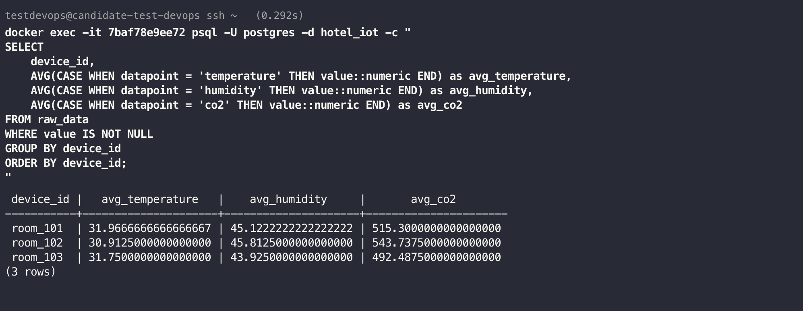
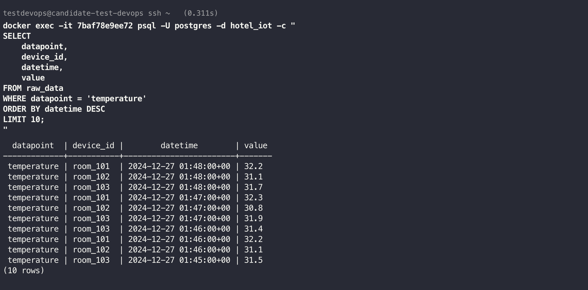
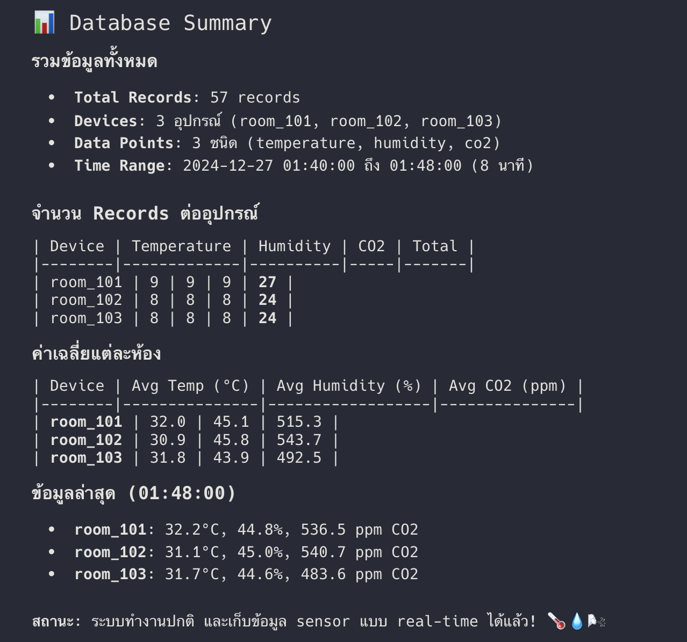

# IoT Data Management System
ระบบจัดการข้อมูล IoT ที่ประกอบด้วย 2 Agent หลักและ Database สำหรับเก็บและประมวลผลข้อมูลจากเซ็นเซอร์

## สถาปัตยกรรมระบบ
```
IAQ Agent → RabbitMQ → DataLogger Agent → TimescaleDB
```
## IAQ Agent (Indoor Air Quality Agent)
**บทบาท**: อ่านข้อมูลจากไฟล์ CSV และส่งข้อมูลเซ็นเซอร์คุณภาพอากาศผ่าน RabbitMQ
### ฟีเจอร์หลัก:
- อ่านข้อมูลจากไฟล์ CSV หลายไฟล์พร้อมกัน
- กำหนดเวลาส่งข้อมูลได้ (Scheduler)
- ส่งข้อมูลต่อเนื่องตามช่วงเวลาที่กำหนด
- เชื่อมต่อกับ RabbitMQ เพื่อส่งข้อมูล
- รองรับข้อมูลหลายห้อง (Room101, Room102, Room103)

### ข้อมูลที่จัดการ:
- อุณหภูมิ (Temperature)
- ความชื้น (Humidity) 
- คาร์บอนไดออกไซด์ (CO2)
- Device ID และ Timestamp

## DataLogger Agent
**บทบาท**: รับข้อมูลจาก RabbitMQ และบันทึกลงฐานข้อมูล TimescaleDB

### ฟีเจอร์หลัก:
- รับข้อมูลจาก RabbitMQ แบบ real-time
- ตรวจสอบความถูกต้องของข้อมูล (Data Validation)
- บันทึกข้อมูลลง TimescaleDB
- ตรวจสอบสถานะการเชื่อมต่อฐานข้อมูล (Health Check)
- สร้าง Views และ Aggregates สำหรับการวิเคราะห์
- รองรับ Database Migration

### ฐานข้อมูล:
- **TimescaleDB**: สำหรับข้อมูล Time-series ที่มีประสิทธิภาพสูง
- **Tables**: sensor_readings, deployment_logs
- **Views**: hourly_averages, daily_summaries

## สรุป *.yaml Files

### ไฟล์การตั้งค่า Services:
1. **1.rabbitmq.yaml** 
   - การตั้งค่า RabbitMQ Message Broker
   - Management UI และ AMQP ports

2. **2.timescaledb.yaml**
   - การตั้งค่าฐานข้อมูล TimescaleDB
   - Volume mounting และ initialization scripts

3. **3.iaq-agent.yaml**
   - การตั้งค่า IAQ Agent service
   - Environment variables และ volume mappings

4. **4.datalogger-agent.yaml** 
   - การตั้งค่า DataLogger Agent service
   - Database connection และ RabbitMQ settings

5. **docker-compose-from-img.yaml**
   - รัน services ทั้งหมดจาก Docker images
   - Network และ dependency management

## การใช้งาน

### เริ่มต้นระบบ:
```bash
docker-compose up -d
```

### ดู Logs:
```bash
# ดู logs ทั้งหมด
docker-compose logs -f

# ดู logs เฉพาะ service
docker-compose logs -f iaq-agent
docker-compose logs -f datalogger-agent
```

### เข้าถึง Services:
- **RabbitMQ Management**: http://localhost:15672 (guest/guest)
- **Database**: localhost:5432 (postgres/password)

## Structure

```
├── iaq-agent/              # IAQ Data Reader & Publisher
├── datalogger-agent/       # Data Consumer & Database Writer
├── sample_data/           # ไฟล์ CSV ตัวอย่าง
├── docker-compose-from-img.yaml  # การรัน services จาก images
└── *.yaml                 # การตั้งค่าแต่ละ service
```

## การพัฒนา

### IAQ Agent:
- เพิ่มไฟล์ CSV ใหม่ใน `sample_data/`
- ปรับเวลา scheduling ใน environment variables
- รองรับข้อมูลเซ็นเซอร์ประเภทใหม่

### DataLogger Agent:
- เพิ่ม validation rules ใหม่
- สร้าง views/aggregates เพิ่มเติม
- ปรับแต่งการบันทึก logs

### Pipeline
- https://github.com/Q-Chakorn/pipline-iot

### หน้าตาข้อมูลใน DB







